# Narrative Engine

## Version 2.0.0

[](LICENSE)
[]()
[]()
[](https://discord.gg/gf3Ntw6pUY)

**Your AI Dungeon Master.** A self-hosted TTRPG engine that runs extended, multi-session campaigns with persistent memory, living NPCs, and automated world management — powered by any OpenAI-compatible LLM or local Ollama model.

No cloud. No subscription. Your campaigns stay on your machine.

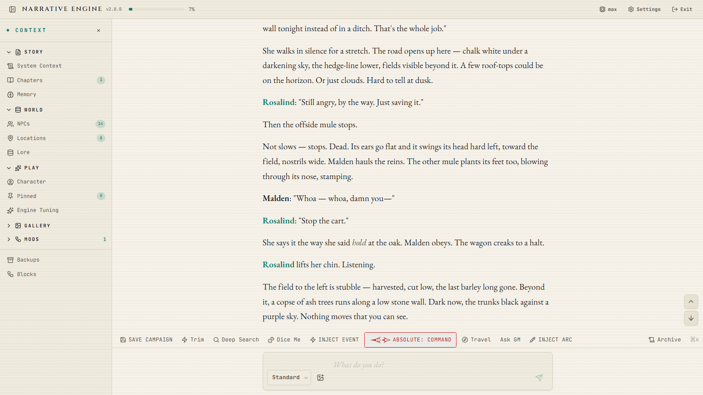

> 📱 **Android client available:** [NarrativeEngine-M](https://github.com/Sagesheep/NarrativeEngine-M/releases/tag/v1.6.20)
>
> 💬 **Join our community:** [Discord Server](https://discord.gg/gf3Ntw6pUY)

**New in 2.0** — a frozen [mod API](docs/MODDING.md) with an **Extensions** tab, a pixel-art [World Map](#world-map-extension--work-in-progress), an [image gallery with vision recall](#images-vision--the-gallery), a [Location Ledger](#location-ledger), and a translated interface.

---

## Getting Started

1. **Clone the repo**
   ```bash
   git clone https://github.com/Sagesheep/NarrativeEngine-P.git
   cd NarrativeEngine-P
   ```

2. **Install & run**

   **Windows** — double-click `Start_Narrative_Engine.bat`

   **Linux / macOS** — run `start.sh`

   **Or manually:**
   ```bash
   npm install
   npm run build --prefix packages/engine
   npm run dev
   ```

3. **Open your browser** at `http://localhost:5173`

4. **Configure your LLM** — open Settings → **Providers** and add your API key + endpoint. Supports OpenAI, Ollama, DeepSeek, and any OpenAI-compatible API.

5. **Create your first campaign** — see [Setting Up Your First Campaign](#setting-up-your-first-campaign) below. The `Example_Setup/` folder ships with ready-to-play worlds, so you can be playing in about two minutes.

**Requirements:** Node.js 20.19 or newer (the LTS build from [nodejs.org](https://nodejs.org/) is fine). Nothing else — no Python, no Docker, no database server.

**Playing from another device on your network:** run `npm run dev:lan` instead of `npm run dev`, then open `http://<your-pc-ip>:5173` from the tablet or phone.

---

## Setting Up Your First Campaign

You do **not** paste lore into a text box. The **New Campaign** form takes files directly, and the engine chunks and indexes them for you.

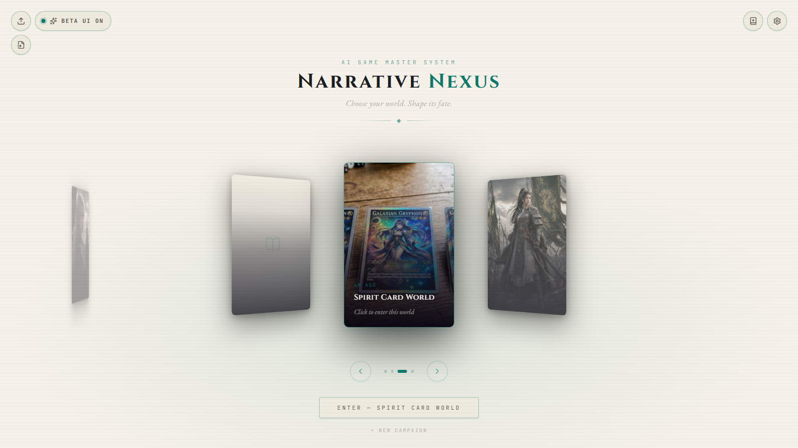

The `Example_Setup/` folder that ships with the repo contains everything you need:

```
Example_Setup/
├── Ruleset/                    ← how the GM behaves (the system prompt)
├── World_compendium/           ← ready-made worlds, one folder each
└── Ability Compendium/         ← optional power/spell libraries
```

### Quick start with an example world (≈2 minutes)

1. On the campaign hub, press **New Campaign**.
2. **Campaign Name** — anything, e.g. `Spirit Card World`.
3. **World Lore (.md)** — pick a world file, e.g.
   `Example_Setup/World_compendium/Spirit Card World/Spirit_Card_World_Lore.md`
4. **Rules (.md)** — pick the current ruleset:
   `Example_Setup/Ruleset/AI_GM_OS_v4.5 - Immersive Mode (Hybrid).md`
5. **World Loot (.json)** — *optional*. Some worlds ship one, e.g.
   `Example_Setup/World_compendium/Class Scroll World/loot.json`
6. **Cover Image** — optional, any image file.
7. Press **Create & Enter**.
8. Open the matching **start prompt** from the same world folder (here, `Spirit_card_world_start_prompt.md`), paste it as your first chat message, and send.

The GM will walk you through character creation and drop you into the world. Every turn after that is handled by the engine.

### Worlds that ship with the app

`Example_Setup/World_compendium/` includes, among others:

| World | Flavour |
| :-- | :-- |
| **Spirit Card World** | Gritty survival fantasy with a card-summoning system |
| **Class Scroll World** | Classic progression fantasy, ships a `loot.json` |
| **Tenebria**, **Inkmark — Circle & Crest** | Original high-fantasy settings |
| **Pure Magic — Medieval Classic** | Classic medieval magic (the world of Arkanus) |
| **Magic & Aura — Shonen Medieval** | Shonen-flavoured medieval action |
| **Fantasy — Cultivation Magic Magitech** | Cultivation and magitech |
| **Averin** | Superpower collapse, hard realism |
| **Themis** | Pokémon-style medieval, gritty |
| **Night City** | Cyberpunk 2077 isekai |
| **Naruto**, **My Hero Academia**, **Chainsaw Man** | Under `Franchisee/` |
| **Three Kingdoms** | War of the Mandate, ships a `loot.json` |
| **ZO — Day Zero** | Zombie apocalypse |
| **Transia** | Modern tokusatsu, urban |
| **City809** | Tech-based post-apocalypse |
| `Community Creation/` | Player-contributed worlds (Warhammer 40k, John Wick, Colonial America) |

Most world folders hold a lore file plus a **start prompt** or **character creation prompt**. Open the folder before you play — some also ship loot tables or design notes.

### Which ruleset should I pick?

`Example_Setup/Ruleset/` holds several GM operating systems. Unless you have a reason not to, use the newest:

- **`AI_GM_OS_v4.5 - Immersive Mode (Hybrid).md`** — the current default. Balanced difficulty, full engine integration.
- `AI_GM_OS_v3.2 - Protagonist Easy Difficulty.md` — forgiving, power-fantasy tone.
- `AI_GM_OS_v3.4 - Protagonist Normal Difficulty.md` — middle ground.
- `AI_GM_OS_Director_Mode_v1.0.md` — director-style pacing control.
- `Archive/` — older versions, kept for reference. You don't need these.

### Writing your own setup

- **Lore** — write your world in Markdown with `##` / `###` headers. Each section becomes a lore chunk the GM can recall. Use `[CHUNK: TYPE -- NAME]` prefixes to classify entries (`world_overview`, `faction`, `location`, `character`, `power_system`, `economy`, `event`, `rules`, `culture`, `misc`). Start from `Example_Setup/World_compendium/lore_template.md`.
- **Rules** — define how the GM behaves: tone, output format, NPC behaviour rules, dice resolution, event protocols. The engine handles memory and recall — you define the style.
- **First Message** — set the scene, ask for character creation, or simply say "begin".
- **World Lore Builder** — prefer a form to a blank page? The 📖 button on the campaign hub opens a structured world editor that exports a ready-to-upload Markdown file.

### Changing files later

Editing an existing campaign re-opens the same form. Uploading a new Lore, Rules or Loot file **replaces** the current one — the label next to each picker says so. Your chat history, NPCs and world state are untouched.

---

## Updating to the Latest Version

When a new version comes out, you can update your local copy without losing your campaigns or settings.

**Windows** — double-click `Update_Narrative_Engine.bat`

It will:
- Download the newest app files from GitHub (`git pull`)
- Run `npm install` to keep dependencies in sync
- Leave your saved campaigns, lore, and API keys untouched (the `data/` folder is not tracked by Git)

**Manual:**
```bash
git pull
npm install
```

**Notes**
- Close the app completely before updating (close any terminal windows titled "Narrative Engine").
- If you downloaded the app as a ZIP instead of cloning it, the updater won't work — download the newest ZIP from GitHub instead.
- If you edited any app files directly, the update may ask before overwriting them. Edits inside `data/` and `mods/` are never touched.

After updating, start the app the same way as before (`Start_Narrative_Engine.bat` / `start.sh` / `npm run dev`).

---

## Troubleshooting

**"Node.js is not installed"** when running the start script
Install the LTS version from https://nodejs.org/ and run the script again.

**"needs Node 20 or newer"** when running the start script
Your Node.js is too old. Upgrade to the LTS version at https://nodejs.org/.

**"NODE_MODULE_VERSION mismatch"** error after upgrading Node
Your database module was built for the old Node version. Run the repair script and choose **option 1 (Quick fix)**:
- **Windows** — double-click `Repair_Narrative_Engine.bat`
- **Linux / macOS** — run `./Repair_Narrative_Engine.sh`

If the repair fails on Windows with a C++ build tools error, install the [Visual C++ Build Tools](https://visualstudio.microsoft.com/visual-cpp-build-tools/) (select "Desktop development with C++") and run the repair again. Alternatively, run the repair script and choose **option 2 (Full clean reinstall)** — it may succeed without needing the C++ build tools.

**"Cannot find native binding" / "rolldown" / "is not a valid Win32 application"** when starting the app
Your dependency install was incomplete (a known [npm bug](https://github.com/npm/cli/issues/4828) with optional dependencies). Run the repair script and choose **option 2 (Full clean reinstall)**:
- **Windows** — double-click `Repair_Narrative_Engine.bat`
- **Linux / macOS** — run `./Repair_Narrative_Engine.sh`

**CORS errors with a cloud provider** (NVIDIA NIM and similar)
Some providers refuse requests made straight from a browser. The engine relays those calls through its own local backend, so this should just work — if it doesn't, check that the server on port 3001 is actually running (`npm run dev` starts both halves).

---

## Memory That Never Forgets

Most AI TTRPG tools suffer from **context drift**. After a handful of sessions the LLM runs out of token space, and suddenly it has no idea who Bob is, what happened in Chapter 1, or why the kingdom is at war. Players notice. Immersion breaks.

Narrative Engine was built from the ground up to solve this. Every piece of your campaign history is preserved and retrievable, no matter how many sessions you play.

### Lossless Scene Archive

Every turn — every dice roll, every line of dialogue, every narrative beat — is archived verbatim. Nothing is summarised away. Nothing is discarded.

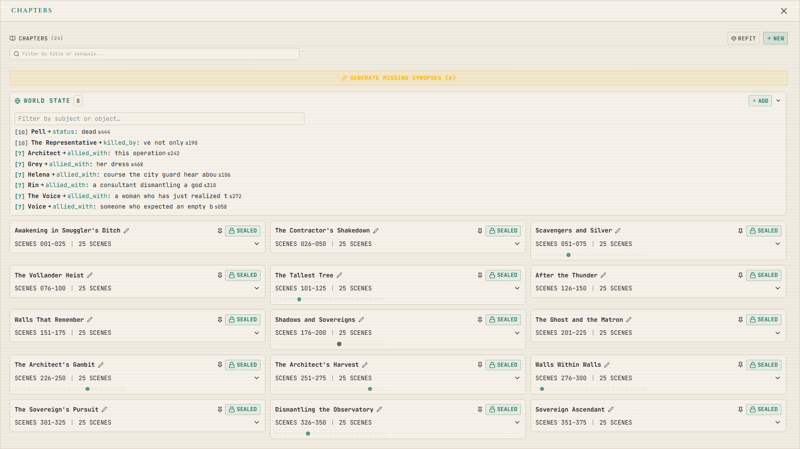

### Two-Phase Deep Archive Search

When the GM needs to recall something from a sealed chapter, it runs a two-stage retrieval pipeline:

1. **Chapter scan** — the engine evaluates LLM-generated chapter overviews to identify which sealed chapters are relevant
2. **Scene retrieval** — within those chapters, specific scenes are retrieved using local vector embeddings (`mixedbread-ai/mxbai-embed-large-v1`, run locally as ONNX through `@huggingface/transformers` and stored in `sqlite-vec` via `better-sqlite3`), ranked by importance, and injected verbatim into context

This means the GM can accurately recall that Bob betrayed the party in Chapter 3 and reference the exact dialogue — even if that was 50 chapters and 200 sessions ago.

### Auto-Condensation

When approaching the token limit, older turns are compressed automatically using one of three strategies:

| Strategy | Compression | Best for |
|---|---|---|
| **Tight** | ~50% | Long-running campaigns, smaller context windows |
| **Smart** | ~75% | Balanced play (default) |
| **Deep** | Maximum detail | Short campaigns, large context windows |

The most recent 8 messages are always kept verbatim. Dice rolls, HP/MP values, and all proper names are preserved exactly. Dramatic moments are tagged and survive re-compression.

### Pinned Memories

Select any passage from the chat and pin it. Pinned excerpts are injected into every GM call until you unpin them — useful for keeping critical plot points, NPC promises, or player-declared intentions in active context.

### World State Tracking (Divergence Register)

A structured fact-sheet the GM maintains throughout your campaign:

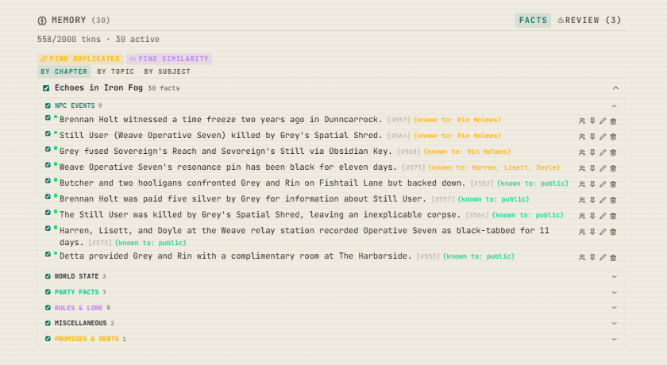

- Automatically extracts world-state facts after each turn: who is where, who holds what, alliances, deaths, promises, debts
- Organised into categories: locations, NPC events, promises & debts, world state, party facts, lore & rules
- Pin high-priority facts so they are always in context regardless of token budget
- AI-assisted structuring for manual entries — paste raw notes and let the engine categorise them
- Semantic deduplication and fact clustering prevent redundant entries from bloating context

### Token Budget Control

- **Token gauge** in the header shows live SYS / HIS / FREE usage against your context limit
- **AI Tier** (`lite` / `pro` / `max`) switches whole classes of background AI work on and off — run `lite` on a cheap model and only the turn itself costs you
- **Per-module token caps** — every optional subsystem (rules, divergence, NPCs, extensions) has a configurable ceiling, so no one feature can eat the whole window

---

## NPC Agency

NPCs are not static text snippets. They are simulated characters with their own psychology, goals, and relationships — all managed automatically in the background.

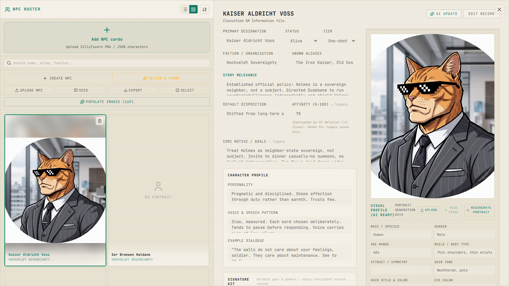

### Auto-Detection & Profiling

NPCs are detected as they appear in the story. The AI generates full profiles: personality, voice, goals, faction, visual description. No manual data entry required. You can also **Seed from Lore** to pre-populate the ledger from your world file before you start playing.

### Personality Hexagon

Each NPC is defined by six psychological axes, each ranging from −3 to +3:

| Axis | Low end | High end |
|---|---|---|
| Drive | Passive | Ambitious |
| Diligence | Careless | Meticulous |
| Boldness | Cautious | Reckless |
| Warmth | Cold | Affectionate |
| Empathy | Detached | Compassionate |
| Composure | Volatile | Stoic |

These values shape how the NPC speaks, reacts, and makes decisions. They drift naturally as the NPC experiences events — a betrayal might erode warmth, while a victory could boost boldness.

### Background Goal Engine

Every NPC maintains three tiers of wants:

- **Short-term** — immediate scene needs (drawn from personality pools, no LLM cost)
- **Medium-term** — session-level goal templates that advance via background dice rolls
- **Long-term** — a single defining ambition, LLM-generated at creation

Each turn, a heartbeat roll determines whether an NPC's goal advances. Successes and failures accumulate. When NPC goals collide, the engine detects the conflict, resolves the "tangle" with dice, and surfaces the results as rumours or direct events in the GM's next response.

### Relationships & Pressure

- **NPC-to-NPC relations** — directed relationship edges (−3 to +3) that evolve based on goal outcomes and collisions
- **PC Relation Meter** — a dedicated tracker for how each NPC feels about the player
- **Pressure system** — `ignored` and `engaged` counters track how the player treats each NPC, with natural decay. Cross a threshold and the NPC's behaviour shifts
- **Behavioural triggers** — keyword-mapped pressure spikes (mention a sensitive topic and the NPC reacts)
- **Boundaries** — hard limits (NPC refuses outright) and soft limits (NPC complies but pressure rises)

### Signature Kit

Each NPC carries a short, bounded **kit** — the gear, weapons and signature powers that define them. It is injected alongside the NPC's core profile, so the swordsman who lost an arm in Chapter 2 doesn't quietly regrow it, and the mage's signature spell stays theirs two hundred scenes later.

### Tiering & Progression

- NPCs are classified as **Recurring**, **One-shot**, or **Walk-on**
- A skill rung ladder (0–4) tracks NPC competence, with promotion possible as goals succeed
- Inactive NPCs are automatically archived to reduce context clutter and restored when they reappear

### Portrait Generation

Generate NPC portraits on the fly in 5 art styles: Realistic, Anime Realistic, Anime, Western RPG, Chibi. Works with any OpenAI-compatible image API, or a local **ComfyUI** install. Images are stored locally.

---

## Your Character

A dedicated player-character panel, separate from the NPC ledger:

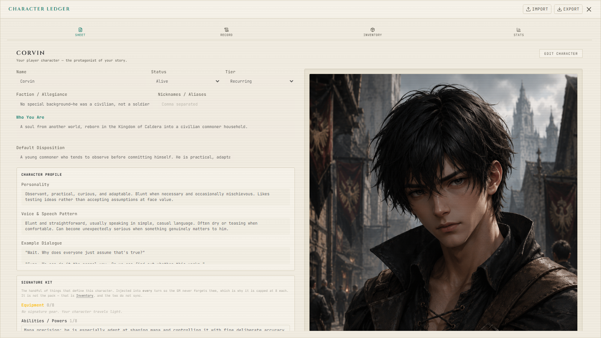

- **PC Creation Wizard** — three steps (questions → stats → review) with point-buy, archetype presets, an OP/Normal budget toggle, derived-stat previews, and AI suggestions per field
- **Character sheet** — stats, narrative traits, inventory, and your own signature kit
- **Inventory staging** — when the GM proposes an item grant, equip or removal, it appears as a staged change you confirm or reject. The GM never silently edits your gear
- **Narrative traits** — up to 10 active traits with event tags, feeding the GM's characterisation of you

---

## World Simulation

### World Arc Engine

Large-scale storylines — political coups, economic crises, supernatural plagues — run as background **World Arcs**. Each arc is a 5-to-12 rung ladder that advances via dice, independently of the player's actions:

- **Stance tracking** — the engine detects whether the player is `opposing`, `aiding`, `ignoring`, `fleeing from`, or `unaware of` each arc, and adjusts difficulty accordingly
- **Avoidance has consequences** — if the player ignores or flees from a direct threat, the world moves without them. The engine writes the consequence as a permanent fact in the Divergence Register
- **Surface tiers** — arc events reach the player as ambient hints, rumours, or direct confrontations depending on the current rung
- One arc runs at a time, so the world escalates along a line you can follow rather than five at once

### Narrative Event Engines

Three probability engines create emergent storytelling:

- **Surprise Engine** — ambient flavour events. Default DC 95, drops by 3 per turn
- **Encounter Engine** — mid-stakes hooks and challenges. Default DC 198, drops by 2 per turn
- **World Event Engine** — seismic world shifts. Default DC 498, drops by 2 per turn. Generates a four-part event: who, what, why, where

The longer nothing happens, the more likely something will. All thresholds, decay rates, and event tables are fully configurable.

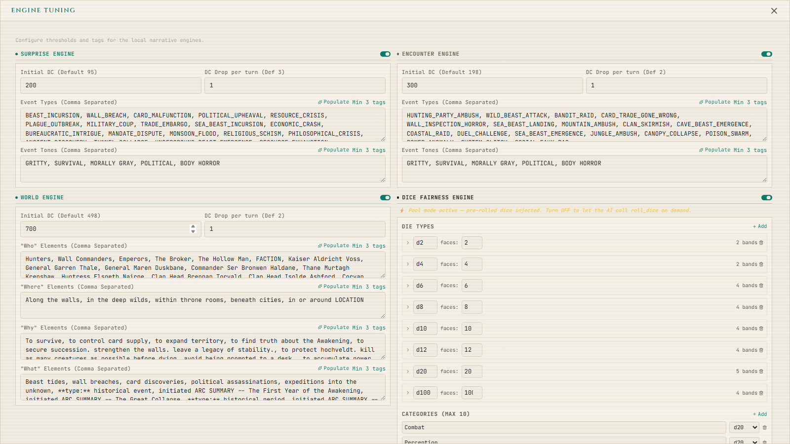

### Timeskip Simulation

Type *"three weeks later"* and the engine handles the gap. It detects the narrative jump, runs background ticks to advance NPC goals, resolves faction conflicts, and updates the world state — so the world has believably moved forward when the player re-engages.

### Knowledge Boundaries

The engine programmatically prevents NPC metagaming:

- **Witness tracking** — every scene records which NPCs were physically present vs. merely mentioned. When recalling past events, witness-matching scenes are ranked higher
- **Faction scoping** — facts in the Divergence Register carry `knownBy` permissions (`player`, `npc:<id>`, `faction:<name>`). An NPC will never reference a secret they shouldn't know about

### Location Ledger

Places get the same treatment NPCs do. The engine detects locations as they appear, records them, and tracks how they connect — each connection carrying a **distance band** and a note rather than an invented number of miles. Locations can be seeded from your world lore before play, exactly the way NPCs are, and the GM is told where the party actually is at the top of every turn.

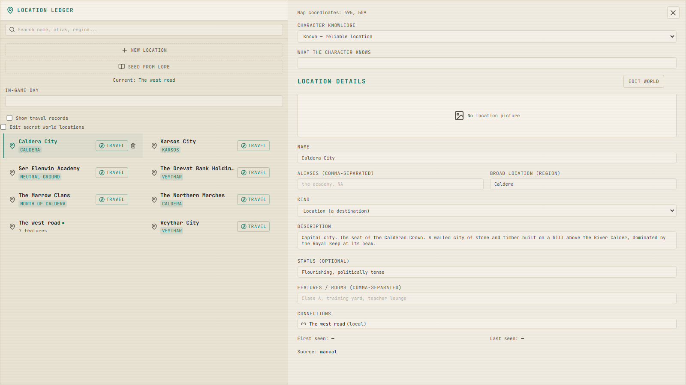

---

## Dice & Combat Fairness

The **Dice Fairness** system pre-rolls d20 pools each turn and injects structured outcomes for 7 skill categories (Combat, Perception, Stealth, Social, Movement, Knowledge, Mundane) across Disadvantage / Normal / Advantage tiers — ensuring the GM uses real rolls rather than fabricating outcomes.

The GM can also call the `roll_dice` tool mid-response for specific checks, receiving a tier result (Catastrophe → Failure → Success → Triumph → Critical) with configurable breakpoints.

---

## Steering the GM

Tools for when the GM's output isn't what you wanted — none of which corrupt the archive:


- **Swipe** — regenerate the last GM reply with a temperature offset and optional written guidance. Variants are generated lazily, one at a time; nothing is committed to the archive until you move on
- **Continue** — extend the last GM reply *in place* instead of replacing it. For when the answer was good but stopped short
- **Absolute Command** — a one-turn out-of-character override. Say what you want to happen, and the engine stands down its Director, watchdog and reminder layers for exactly one turn
- **One-Shot Event Injector** — arm a specific event ("the roof collapses") and it fires on the next turn, once
- **Arc Injector** — force the next rung of the active world arc to surface now
- **Ask GM** — an out-of-character side chat that doesn't touch the story. Its answer can be armed and passed to the Story AI if you want it to land
- **Lore Check** — see below
- **Rollback** — undo any scene and cascade the entire world state back with it

---

## Lore Check

A consistency QA tool you can run on any message:

- Select text from any chat message to flag it for review
- Choose from check categories: wrong fact, contradicts lore, wrong NPC/place, tone mismatch, out of character
- The engine cross-references your lore chunks, chapter archive, and sealed chapters
- Returns a verdict (consistent / unsupported / contradicts), specific issues with citations, and a suggested rewrite
- Accept the rewrite with one click to replace the message in place

---

## Images, Vision & the Gallery

Every picture in a campaign carries text with it, which is what makes an image usable at turn 700 instead of only at turn 7.

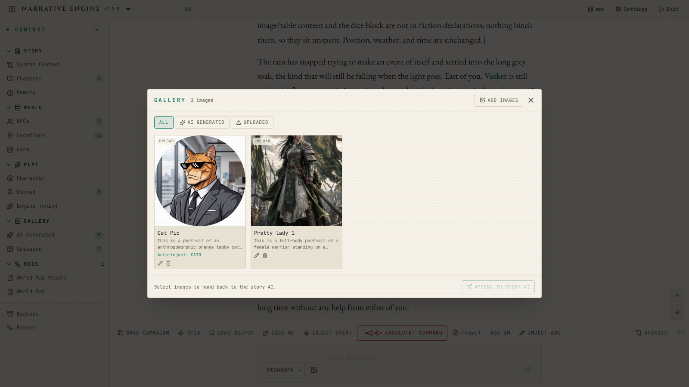

- **Paste an image into chat** — a vision-capable model captions it, and the caption becomes part of the turn
- **Campaign gallery** — every generated scene image and every upload in one place, filterable, bulk-importable
- **@mention an image** — pull a picture back into the GM's context by name. Its caption is injected for that turn only, so recalling the same costume fifty times doesn't stack fifty copies in your history
- **Standing offers** — if you're clearly talking about an image already in the gallery, the engine offers it, and sending accepts the offer
- **Scene illustration** — generate artwork for the current scene through any OpenAI-compatible image API or a local ComfyUI install

---

## LLM Tool Calls

The GM can use tools mid-conversation:

- **Query Campaign Lore** — the GM searches your world bible on the fly when it needs a detail
- **Update Scene Notebook** — a volatile working memory for tracking active spells, timers, NPC positions, environmental conditions, and combat state
- **Roll Dice** — request a specific skill check with tier-mapped results
- **Propose Inventory Change** — suggest adding, removing, or equipping items (player must confirm)
- **Initiate Combat** — signal that combat is beginning and list hostile combatants

Works with OpenAI function calling and DeepSeek models (with DSML fallback parsing).

---

## Extensions (Mods)

Version 2.0 moved whole features out of the core app and behind a **frozen mod API**. Open **Settings → Extensions** to see what's installed, toggle anything off, or press **Rescan** after dropping in something new.

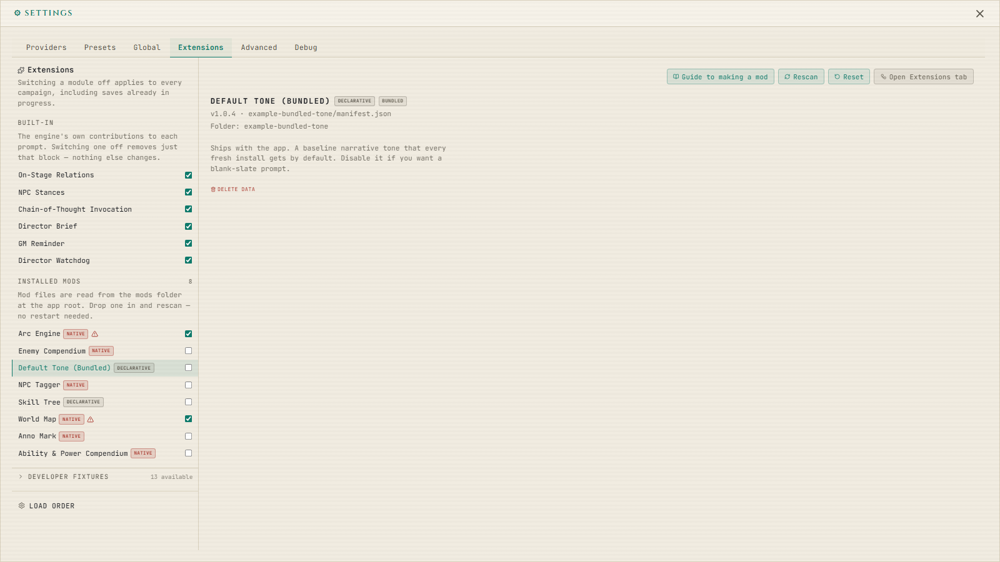

### Installing a mod

Put the folder under `mods/` at the app root — next to `data/`. It is created for you on first run.

```
Narrative Engine/
├── data/        ← your campaigns
└── mods/        ← your mods
    └── grimdark-tone/
        └── manifest.json
```

No restart needed. Drop the folder in, open **Settings → Extensions**, press **Rescan**, enable it.

**Disabling a mod freezes its data — it does not delete it.** Re-enable and everything is where you left it. Deleting a mod drops only that mod's own tables; the rest of your campaign is untouched.

### What ships enabled

| Extension | What it does |
| :-- | :-- |
| **Default Tone** | The baseline narrative voice every fresh install gets. Disable it if your ruleset sets its own tone |
| **Enemy Compendium** | Enemies, instances, encounters, combat and discovery |
| **World Map** | Pixel-art overworld — [see below](#world-map-extension--work-in-progress) |

Optional extras live in `mods/` in the repo, including the **Ability & Power Compendium** (canonical spell/skill/feat libraries with mastery, cooldowns and charges — the D&D 5e SRD 5.2.1 reference library in `Example_Setup/Ability Compendium/` imports straight into it), a skill tree, an NPC tagger, and several small example mods worth reading before you write your own.

### Writing a mod

Read **[`docs/MODDING.md`](docs/MODDING.md)** — it is the single author-facing reference, and it is written to be handed to an AI before it writes a mod. Type definitions are in [`docs/narrative-mod-api.d.ts`](docs/narrative-mod-api.d.ts).

Three tiers, all expressible in one manifest:

- **Declarative** — JSON only. Adds text to the prompt under conditions you choose. No code, no UI
- **Sandboxed compute** — one JS file run in a Worker for a few hundred milliseconds after each turn. A real capability boundary; no page access
- **Native** — one JS module imported into the page. Lifecycle hooks, mount points, the event bus, the pre-prompt interceptor, macros, facts, budgets, the tokenizer

The API surface is frozen at **generation 1** and is additive-only until the generation number changes.

---

## World Building Tools

### World Map *(extension — work in progress)*

A pixel-art overworld that reads the Location Ledger rather than replacing it. It ships **enabled but unfinished** — version 0.6.0-wip — because a half-built map that draws real terrain and walks a real journey is more useful than a hidden one. [`public/bundled-mods/worldmap/STATUS.md`](public/bundled-mods/worldmap/STATUS.md) is an honest account of what is and isn't done.

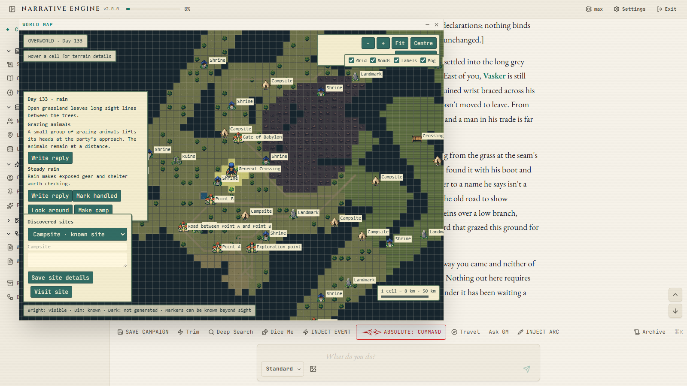

What works today:

- **Terrain** — twelve biomes, eight textured variants each, hillshade, contour lines, coastal shading
- **Places from the ledger** — anchored by their recorded relations and distance bands, not by a coordinate you have to author
- **Travel as an engine action** — A* routing over the grid, terrain-priced day counts, camps placed on real cost. One press moves one day, with no LLM call and no chat spam
- **Fog of war** — cells harden as you visit them; trails persist
- **Discoveries and encounters** — spaced, setting-aware events on the road

Travel can be started from the map, the Places panel, or the composer — all through the same code path.

### World Lore Builder

A structured pre-game world editor, reachable from the 📖 button on the campaign hub:

- Dedicated fields for world background, languages, power systems, technology level, timeline, tone, and house rules
- Expandable lists for geography, factions, cultures, threats, and pre-seeded NPCs
- Export to Markdown with one click — the result drops straight into the **World Lore** slot of the New Campaign form
- Import Markdown with a smart review modal that merges changes without overwriting your work
- Multiple draft worlds — switch between them or delete old ones

### Rules Manager

Your ruleset is automatically chunked and indexed. Each rule chunk gets AI-generated trigger keywords so the engine retrieves only the relevant rules for each turn, keeping token usage efficient.

---

## Backups & Rollback

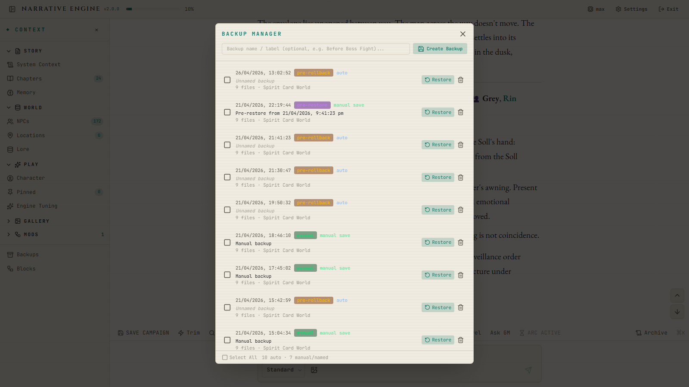

- **Automatic backups** before any risky operation
- **Manual labelled backups** at any time
- **Batch backup deletion** for cleanup
- **Scene-level rollback** — undo any scene and the entire world state (timeline, chapters, NPCs, Divergence Register) cascades back to that point
- Pre-rollback safety backup so you can never lose data
- **Export / import a whole campaign** as a single file from the campaign hub — move a game to another machine, or hand it to a friend

---

## Security & Privacy

- **Encrypted API key vault** — AES-256-GCM encryption, password-optional
- **Machine-key mode** — no password needed, keys auto-unlock on your device
- **Password mode** — PBKDF2 with 100K iterations for full lock-down
- **Client-side encryption** — API keys are encrypted in the browser before they touch the server
- **100% local vector search** — all semantic memory, lore queries, and embedding operations run locally via `@huggingface/transformers` (ONNX models) and `sqlite-vec`. No campaign text is sent to third-party vector providers
- **Local relay for provider calls** — requests to your LLM can be routed through your own backend, so providers that reject browser-origin calls work without handing anything to a third party
- All campaign data stored as local files — no database server, no cloud, no vendor lock-in
- Export and import your vault for backups

---

## Supported LLM Providers

Any OpenAI-compatible API works. Configure up to 5 endpoints per preset:

| Role | Purpose |
|---|---|
| **Story AI** | Main GM narration — required |
| **Summarizer AI** | Condensing old history (can use a cheaper/faster model) |
| **Utility AI** | Lore checks, divergence structuring, archive reranking, rule indexing |
| **Image AI** | Portrait and scene illustration generation (OpenAI-compatible or ComfyUI) |
| **Auxiliary AI** | Witness capture, NPC intro engine, scene analysis fallback |

Each endpoint has its own model, API key, base URL, and sampling config (temperature, top-p, max tokens). Thinking/reasoning effort is supported where the provider offers it.

Works with Ollama for fully local play — no internet required after setup.

---

## Text-to-Speech

Optional local narration via Kokoro — no API key, no cloud. Enable it in Settings, pick a voice, and each GM message gains a playback panel with karaoke-style sentence and word highlighting, adjustable speed, replay, and click-to-jump on any sentence.

---

## Languages

The interface ships in **English, Korean, Russian, Polish and Indonesian**. Pick yours under Settings → **Interface Language**. This changes menus and buttons only — your campaign, your lore and the GM's narration are in whatever language you write them.

Anything not yet translated falls back to English, so a partial translation is perfectly usable.

**Want to add your language?** See **[`docs/TRANSLATING.md`](docs/TRANSLATING.md)** — one file to edit, no tools to install, and you do not have to finish.

---

## Quick Reference

| Action | Command |
|---|---|
| Install & run (Windows) | Double-click `Start_Narrative_Engine.bat` |
| Install & run (Linux / macOS) | Run `start.sh` |
| Update to latest (Windows) | Double-click `Update_Narrative_Engine.bat` |
| Repair a broken install (Windows) | Double-click `Repair_Narrative_Engine.bat` |
| Update to latest (manual) | `git pull` then `npm install` |
| Install manually | `npm install` |
| Start the app | `npm run dev` |
| Start for LAN / tablet play | `npm run dev:lan` |
| Build for production | `npm run build` |
| Run tests | `npm run test` |
| Lint | `npm run lint` |
| Check translations | `npm run i18n:check` |

### Where things live

| Path | What's in it |
|---|---|
| `data/` | Your campaigns, backups, settings, vault, embeddings — **never committed** |
| `mods/` | Your installed extensions |
| `Example_Setup/` | Ready-to-play worlds, rulesets and ability compendiums |
| `docs/MODDING.md` | How to write an extension |
| `docs/TRANSLATING.md` | How to translate the interface |

---

## License

This project is licensed under the [MIT License](LICENSE) — Copyright (c) 2026 Sagesheep.
